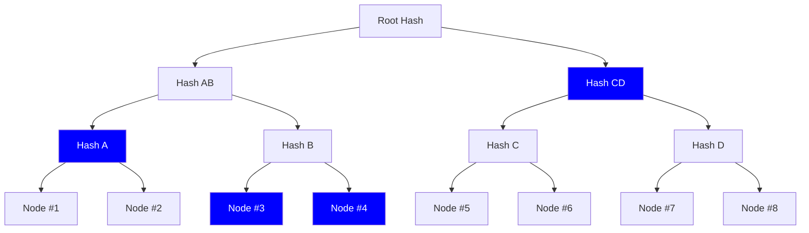
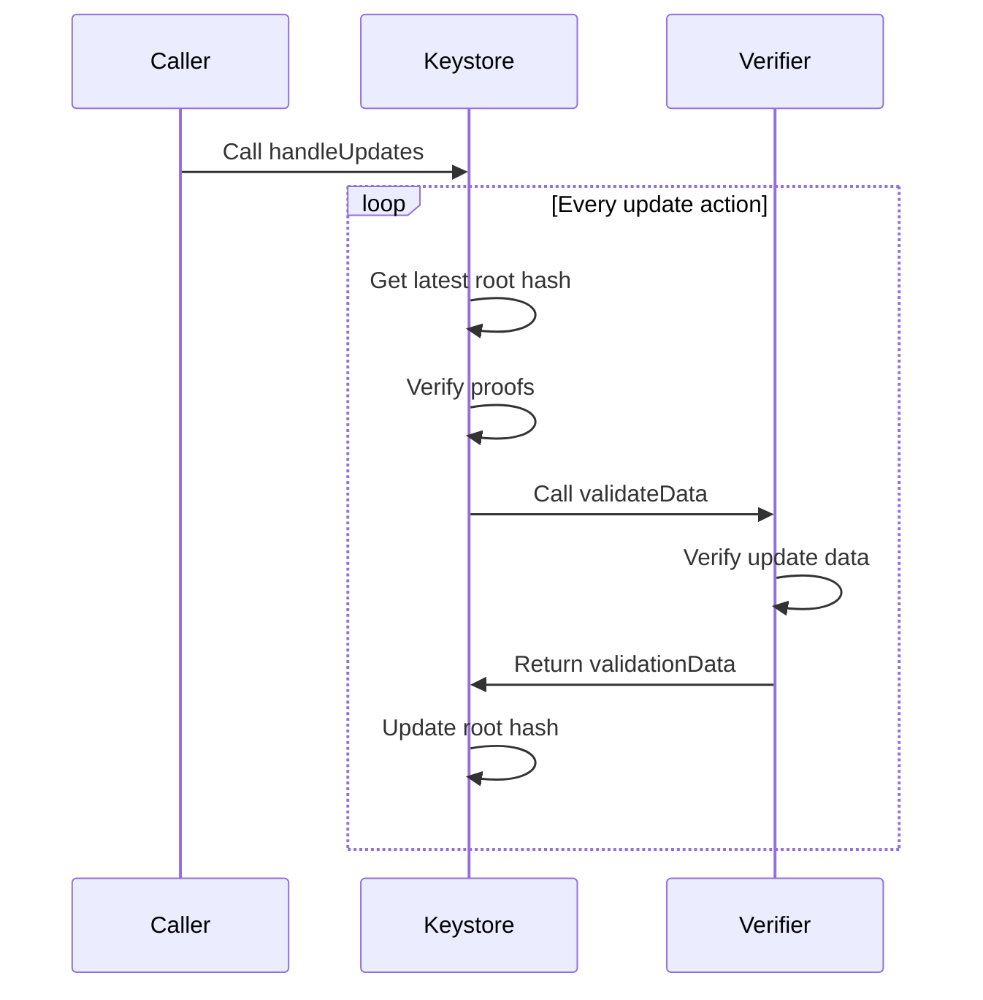
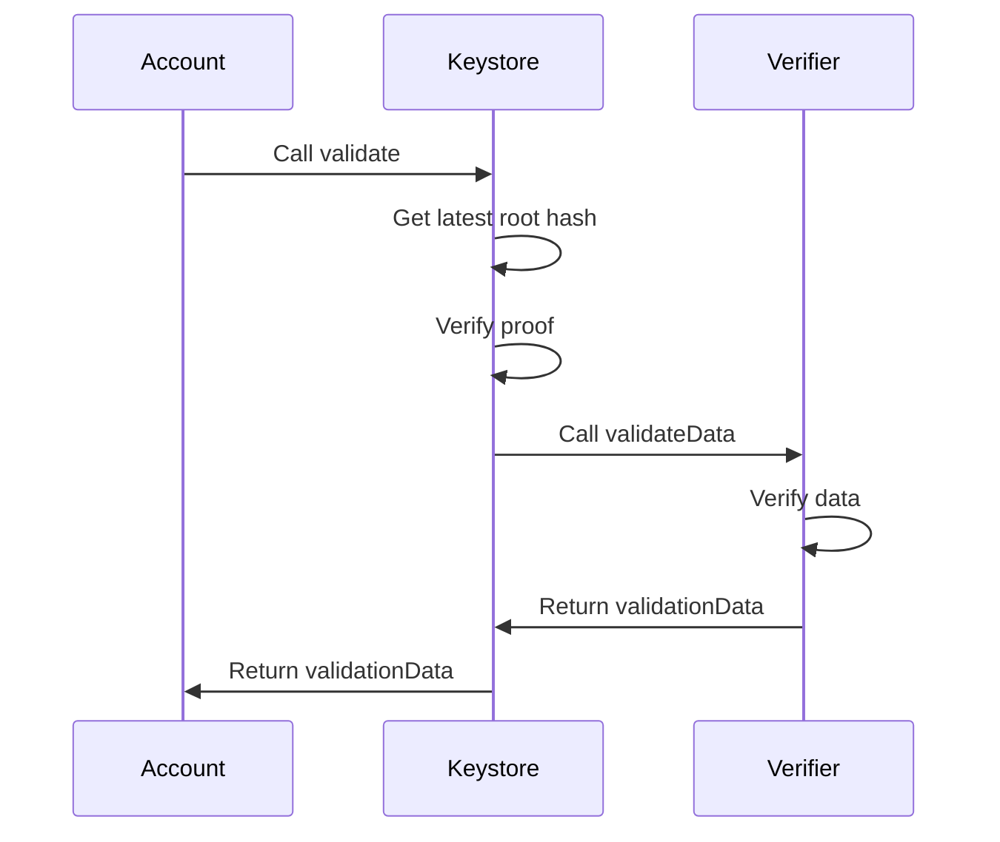

# Merkle Tree Keystore for Account Abstraction

Smart accounts currently face UX challenges in scaling configuration. We define configuration here as any state that the account requires in order to validate transactions. Today, many smart accounts use simple schemes such as a single owner key or an N/M multisig setup. As smart account validation evolves (e.g. with permissions, multi-user sessions, and role-based access controls), configuration size also increases substantially. In this world, we quickly run into three issues.

1. **Gas cost**: The onchain storage cost of configuration makes support for modern verification use cases unfeasible.
2. **Chain fragmentation**: If an account exists on `N` chains, a lot of friction is required to ensure cross-chain sync.
3. **Lack of privacy**: Public exposure to an account's full configuration (e.g. a guardian set used for recovery) can introduce op-sec risk.

On point 2, there are also significant UX challenges in a scenario where an account hasn't yet been deployed to a new chain. For example, in any setup that is initialized with an admin key, the user must retain secure access to the original admin key to deploy the account followed by an immediate rotation to the current key. This not only creates friction but also contradicts best practices of frequent and secure key rotations.

This specification directly solves the gas and privacy issues while allowing composability with external cross-chain infrastructure to solve fragmentation.

## Specification

This approach covers 3 key components:

1. `UserConfiguration` Merkle tree
2. Singleton `Keystore` contract
3. Stateless `Verifier` contract

### `UserConfiguration` Merkle tree (UCMT)

The `UserConfiguration` is a Merkle tree data structure designed to accommodate any arbitrary verification scheme. Each `node` is packed with 20 bytes (starting at the most significant bit) allocated to the `Verifier` address and the remaining dynamic size bytes for the config.

| Field    | Type      | Description                                                     |
| -------- | --------- | --------------------------------------------------------------- |
| verifier | `address` | Address pointing to the stateless `Verifier` contract           |
| config   | `bytes`   | Arbitrary calldata provided to the `Verifier` during validation |

```solidity
bytes node = abi.encodePacked(verifier, config)
```

The practical usage of this structure is detailed in subsequent sections. An essential point is that the entire Merkle tree itself is not stored onchain. Instead, only the resulting root hash is stored in the `Keystore` singleton. During a transaction, only a proof is used to validate that the UCMT has a specific node.

#### Abstract example

Consider an account with the following configuration. Suppose a transaction requires validation using `Node #3`. To validate this, a Merkle proof is generated using only the highlighted hashes below. These hashes enable the reconstruction of the root hash which can then be compared against the saved `Keystore` value.



### `Keystore` singleton

The `Keystore` is a permissionless singleton contract that can be deployed on any chain. It is responsible for:

1. Storing a reference to the latest UCMT root hash.
2. Coordinating a UCMT root hash update.
3. Coordinating transaction validation from dependent accounts.

#### `Keystore` interface

This singleton MUST have the following interface.

```solidity
struct UpdateAction {
    bytes32 refHash;
    bytes32 nextHash;
    uint256 nonce;
    bool useChainId;
    address account;
    bytes proof;
    bytes node;
    bytes data;
    bytes nextProof;
    bytes nextNode;
    bytes nextData;
}

struct ValidateAction {
    bytes32 refHash;
    bytes32 message;
    bytes proof;
    bytes node;
    bytes data;
}

interface Keystore {
    error InvalidNonce();
    error InvalidProof();
    error InvalidNextProof();
    error UnregisteredProof();
    error InvalidNode();
    error InvalidVerifier();

    event RootHashUpdated(
        bytes32 indexed refHash, address indexed account, bytes32 indexed nextHash, uint256 nonce, bool success
    );

    function handleUpdates(UpdateAction[] calldata actions) external;
    function validate(ValidateAction calldata action) external view returns (uint256 validationData);

    function registerNode(bytes32 refHash, bytes32[] calldata proof, bytes calldata node) external;
    function getRegisteredNode(bytes32 refHash, address account, bytes32 nodeHash)
        external
        view
        returns (bytes memory);

    function getRootHash(bytes32 refHash, address account) external view returns (bytes32 rootHash);
    function getNonce(bytes32 refHash, address account, uint192 key) external view returns (uint256 nonce);
}
```

#### Storage of root hashes

All root hashes in the `Keystore` contract MUST be stored in a mapping of the initial root hash (i.e. the `refHash`) to the current root hash.

```solidity
mapping(bytes32 refHash => mapping(address account => bytes32 rootHash)) internal _rootHash;
```

This is essential in order to provide an account with a permanent reference to the latest configuration. Without a permanent reference, it would be impossible for a dependent account to generate counterfactual addresses that are decoupled from configuration updates.

In the initial edge case where `rootHash` is equal to zero, then the `Keystore` MUST assume the `refHash` as the current root hash. External systems are able to query for the current root hash using the `getRootHash` method which takes this logic into consideration.

#### Handling root hash updates

Updating a configuration set is equivalent to updating the current root hash in the `Keystore`. The essential data structure in this flow is the `UpdateAction` intent.

| Field        | Type      | Description                                                                                         |
| ------------ | --------- | --------------------------------------------------------------------------------------------------- |
| `refHash`    | `bytes32` | Permanent reference hash for the UCMT.                                                              |
| `nextHash`   | `bytes32` | Next root hash after the update.                                                                    |
| `nonce`      | `uint256` | 2D nonce with packed `uint192` key and `uint64` sequence. Prevents replaying updates.               |
| `useChainId` | `bool`    | A flag to signal the `Keystore` to include the `chainId` in the message for chain specific updates. |
| `account`    | `address` | The account address tied to this `refHash`.                                                         |
| `proof`      | `bytes`   | Merkle proof for the node.                                                                          |
| `node`       | `bytes`   | Node data containing `verifier` and `config`.                                                       |
| `data`       | `bytes`   | Arbitrary data for the verifier.                                                                    |
| `nextProof`  | `bytes`   | Merkle proof for verifying inclusion of the `node` or `nextNode` in the updated root hash.          |
| `nextNode`   | `bytes`   | Optional next node data containing `verifier` and `config`. If `nil`, `node` will be used.          |
| `nextData`   | `bytes`   | Optional arbitrary data for the next verifier. If `nil`, `data` will be used.                       |

On a systems level, the root hash update has the following lifecycle.



This process begins with the `Caller` initiating the `handleUpdates` function on the `Keystore` contract. For every `UpdateAction` in the batch, the `Keystore` MUST verify the UCMT proofs. If ok, then the `Keystore` calls `validateData` on the `Verifier` encoded in the `node`. This will check if the update to the next root hash is valid and returns a corresponding `validationData` value.

Note that `handleUpdates` accepts a batch of `updateAction` objects by design in order to support use cases where other entities, such as solvers, are relaying updates on behalf of many accounts.

The returned `validationData` is a `uint256` with no implied structure except for a literal value of `1` which MUST signal a failed validation. Besides this, the `Verifier` and downstream callers are free to interpret this value in any way they see fit. This pattern was made to be especially adaptable with ERC-4337 which has specific standards for packing `validUntil` and `validAfter` values for a transaction.

##### Next root hash validation

As a safety mechanism to prevent account bricking, the `Keystore` will also verify that the root hash of the next UCMT can be accessible by at least one known node. To do this, an `UpdateAction` has a mandatory field for `nextProof` and optional fields for `nextNode` and `nextData`. During an update, two flows are considered.

1. The current `node` is included in the next UCMT. In this case `nextNode` and `nextData` is set to `nil`. The `Keystore` will verify `nextProof` and only a single `node` verifier call is required.
2. The current `node` is NOT included in the next UCMT. In this case, `nextNode` and `nextData` is required. The `Keystore` will verify `nextProof` and make an additional call to the `nextNode` verifier.

##### Replay protection

In order to prevent replaying old updates the `Keystore` MUST use a nonce mechanism. We implement a 2D nonce in order to allow for easier expansion into new chains without having to "catch up" to the latest nonce of the canonical chain. For example, with a 1 dimensional nonce, if the root hash has been updated X times on chain A before broadcasting to chain B then chain B must effectively re-run X number of old updates to be at the latest nonce. This is solved with a 2D nonce since adding a new chain would just require an increment of the nonce key which would reset all chain sequences back to 0.

#### Using the `Keystore` for validation

The validation flow for an account that uses the `Keystore` singleton will have the following sequence.



During the account's validation phase, it makes a call to the `validate` function on the `Keystore`. The `Keystore` MUST verify the UCMT proof. If ok, then the `Keystore` calls `validateData` on the `Verifier` encoded in the `node`. This will check if the given signature for the message is valid and returns the corresponding validationData value.

#### Optional node caching mechanism

In the common case where a node is used for many transactions, it is a waste of gas to submit the same proof and node every time. Instead the `Keystore` has an optional method to cache a node with `registerNode`. This method will validate the UCMT proof and cache the `node` for a given `refHash` and `msg.sender`.

During a validation flow, the `Keystore` will use the following logic to decide wether or not to use the cache:

- **No cache**: If `action.proof` is NOT empty, then assume `action.node` is the actual `node` and run Merkle tree validation.
- **With cache**: If `action.proof` is empty, then assume `action.node` is the hashed `keccak256` node. This is used to fetch the actual `node` from the cache and skip Merkle tree validation.

Caching a node is optional since not all nodes can be assumed to be reused. Some use cases, such as an N/M guardian set for recovery, might be intended to only be used once. In such a case, the gas cost of caching is not required.

### Stateless `Verifier`

The `Verifier` is a contract that enables any arbitrary signature scheme with no requirement for persistent onchain storage. Instead the `Verifier` can trust that the config passed by the `Keystore` has been cryptographically verified by the UCMT proof.

#### `Verifier` interface

```solidity
interface Verifier {
    function validateData(bytes32 message, bytes calldata data, bytes calldata config)
        external
        view
        returns (uint256 validationData);
}
```

The `data` input is passed in by the user during a transaction and the `config` input is always equal to the `config` portion of the UCMT `node`.

In the example of an ECDSA verifier, the `data` could be the 64 byte ECDSA signature while the `config` is the 20 byte signer address. The function `validateData` would then return an equality check on `config == ecrecover(message, data)`.

It is worth noting that there is no enforced data structure on the `data` and `config` input. This is entirely up to the `Verifier` to determine based on the intended validation scheme.

#### `Verifier` message format for a root hash update

When updating the root hash, the `Keystore` MUST call the `validateData` function with the following `message` format.

```solidity
bytes32 message = useChainId
    ? keccak256(abi.encode(refHash, nextHash, account, nonce, keccak256(node), block.chainid))
    : keccak256(abi.encode(refHash, nextHash, account, nonce, keccak256(node)));
```

Note that by default, `chainId` is not part of this message hash since it is expected that an `UpdateAction` can be replayed across all chains. However, under certain scenarios where a user does NOT require cross chain replayability, the `useChainId` flag in `UpdateAction` can be set to `true`. The resulting message hash will then include the `chainId` for signing.

## Rationale

Scaling smart account configuration involves many trade-offs. This section outlines why several key decisions were made for this specification.

### Using a Merkle tree

When approaching the problem space, two primary requirements must be satisfied:

1. A `Keystore` singleton must support arbitrary validation logic.
2. The solution must be gas-efficient regardless of the validation scheme.

As account validation evolves to accommodate increasingly complex scenarios, it is expected that the configuration size expands with it. An alternate solution that directly stores configuration onchain may suffice for single validation methods like ECDSA or WebAuthn. However, this approach quickly becomes restrictive due to `SSTORE` gas costs when implementing advanced use cases that cover the full spectrum of authentication and authorization.

Implementing a Merkle tree effectively addresses these concerns:

- A `Verifier` adhering to the proposed interface can implement any arbitrary validation logic.
- Gas cost is optimized by storing only the root hash in a single storage slot and handles verification in `O(log n)` space and time complexity (`n` equal to the total number of nodes).

This design decision also introduces important implications regarding privacy and data availability. By keeping the full configuration set offchain, accounts consequently benefit from enhanced privacy and allows them to selectively disclose validation details only when necessary. For instance, an account configured with an N/M guardian scheme can keep each guardian private until social recovery flows are explicitly triggered.

Because configuration is stored offchain, accounts MUST have reliable access to the Merkle tree to generate the necessary proofs. To preserve the outlined privacy benefits, this proposal deliberately avoids prescribing specific storage mechanisms.

### Cross-chain fragmentation

We've mentioned earlier that one significant challenge in scaling account state is ensuring it remains in sync across many chains and access can always be granted on new chains using the latest config. Although this standard does not propose a direct solution it does open a pathway for composability with external cross-chain infrastructure depending on the wallet's preference.

Since `Keystore` supports batch updating via `handleUpdates`, this enables any independent entity to update config on behalf of many accounts based on their own agreed upon trust assumptions or incentive models.

#### Simple example with delegated relayers

A very simple approach for achieving cross chain sync is if a wallet delegates a relaying service to broadcast updates to all chains. In this approach there are two main concerns which are the security and incentives for relayers.

On security, it is not possible for a relayer to tamper with the `updateAction` object. Doing so will cause the `Keystore` to reject the update due to an invalid Merkle tree proof. It is also technically possible for any entity to watch for updates on one chain and copy them onto another chain if they are willing to pay the gas fee. Therefore the only reason a relayer would broadcast updates is if they are sufficiently compensated to do so.

In order to not blow up the complexity of this spec, a built in method for gas compensation was not added by design. Compensation for relayers could either be handled offchain (e.g. wallet pays for a relaying service) or onchain (e.g. wallet delegates a subscription like permission to the relaying service).

### Decoupling `Keystore` from the account to a singleton

The Keystore is required to be a decoupled from the account in order to ensure configuration can always be updated regardless of whether or not the account is deployed. If this same approach was built into the smart account code, then syncing config across new chains must always be preceded by an account deployment. This is problematic given that the account deployment will then have to be validated with potentially outdated config.

The singleton property is also required in order to preserve the deterministic deployment properties of a smart account. The smart account should always be initialized with the singleton address and `refHash`. What the `refHash` points to is then free to change and won't impact the account's deterministic address.

### Relation to ERC-4337

The specification makes no strong coupling to the ERC-4337 standard other than sharing a constant value for `validateData`. This is by design since the Keystore must be upstream of the smart account and agnostic to any particular account abstraction versions. However it is worth mentioning a couple of implementation details that makes integrating with ERC-4337 viable.

#### ERC-7562 compliance

The `Keystore` storage access was designed in order to make it compliant with the validation scope rules defined in ERC-7562. STO-10 of the validation rules outlines that read and writes to an external and non-entity contract must be associated with the account. This is why all storage is defined as a nested mapping that includes the account address in order to prevent the `Keystore` from being used for potential DoS attacks on the mempool. This not only makes it compatible with ERC-4337 but also future proofs it for native account abstraction too.

#### Account and `Verifier` protocol

During validation, an ERC-4337 account receives a `PackedUserOperation`. Account implementations SHOULD encode the `proof`, `node`, and `userOpHashSignature` into the initial `UserOperation` signature field. When the account calls to the `Keystore` during `validateUserOp` it SHOULD repack the `UserOperation` and replace the signature field with the `userOpHashSignature` only. An ERC-4337 aware `Verifier` SHOULD assume this during a `validateData` call.

This repackaging is not strictly required but strongly recommended in order to reduce calldata size. The `validate` function on the `Keystore` requires a `ValidateAction` input which will need the `proof` and the `node`. Therefore the `data` should be a repacked `UserOperation` with the `proof` and `node` stripped out of its signature field to prevent redundant bytes. Further, the `proof` and `node` should only be required by `Keystore` to validate Merkle tree inclusion and is not generally used by the `Verifier`.

More concretely, a call from an account's `validateUserOp` function to the `Keystore` could follow these simple steps:

1. Decode `proof`, `node`, and `data` (i.e. `userOpHashSignature`) from `userOp.signature`
2. Create a `ValidateAction` object with the following params:
   - `refHash`: from account storage
   - `message`: the `userOpHash` input
   - `proof`: from the `userOp.signature`
   - `node`: from the `userOp.signature`
   - `data`: the repacked `userOp` (replaced signature field with `userOpHashSignature`)
3. Call `validate` on the `Keystore` and return back the result

An argument could be made that the `ValidateAction` data structure is redundant if the `Keystore` is made to be `userOp` aware. However, as mentioned above, we avoid this to make the `Keystore` maximally generalizable to downstream account abstraction interfaces.

## Security Considerations

Assuming the `Keystore` contract is audited and verified to be safe, there are some downstream security considerations worth noting.

### `Verifier` should only trust the `Keystore`

Because the `Verifier` is not required to store configuration, it must trust the given config from a `validateData` call. If this config comes from the `Keystore` then it can be trusted given its validity has been cryptographically guaranteed by the Merkle tree proof. Therefore, a `Verifier` should only be called by the `Keystore` and calling the `Verifier` directly (e.g. via the account) should be avoided.

### Signature replayability on the `Verifier`

`Verifier` contracts in this specification are intentionally stateless. The `validateData` call only attests that the provided signature (i.e. `data` input) correspond to the given `message` under the provided `config`. They do not track or consume nonces. As a result, signature replayability is a property of the upstream protocol that constructs the `message`, not of the `Verifier` itself. Common examples of this are detailed below.

- **Update flow (`handleUpdates` call)**: Replay is prevented by the
  `Keystore` via a 2D nonce packed into `UpdateAction.nonce`. Cross chain replay can also be prevented by binding the signed message to the `chainId` with the `action.useChainId` flag. The `Verifier` does not need to add additional nonce checks here.
- **Validation flow (`validate` call)**: The `Keystore` forwards an arbitrary `message` chosen by the caller (typically the account). The `Verifier` only checks signature validity over that `message` and returns success or failure. Whether a valid signature can be replayed depends on how the `message` was formed.
  - **ERC-4337 accounts**: The `message` SHOULD be the `userOpHash` which considers the `UserOperation` nonce. Replay protection is therefore provided by the ERC-4337 protocol. Submitting the same signed `userOpHash` again will fail due to the consumed account nonce.
  - **ERC-1271 / off-chain signatures**: If the `message` does not include a nonce, timestamp window, session identifier, or other anti-replay material that is enforced by the upstream protocol or application, then a valid signature over the same `message` will be replayable by design.

### Users and wallets must have a secure process for adding `Verifiers`

The `Keystore` does not impose any checks on each node beyond verifying its inclusion within the Merkle tree. The upside is that any verification scheme can be supported as long as the `Verifier` adheres to the correct interface. However, this could also pose a security risk if not careful. For example, a verifier that always returns `SIG_VALIDATION_SUCCESS` could allow a full account takeover by any entity that can generate a correct proof. To prevent this the following recommendations should be followed by users and wallet developers.

- `Verifier` code MUST be audited and transparent.
- All account stakeholders MUST have access to the full Merkle tree.
- Stakeholders MUST be able to verify the expected Merkle tree aligns with the root hash stored onchain in order to prevent malicious interfaces from hiding unknown nodes.

### Handling the Merkle tree data structure

The Merkle tree itself is not considered a secret value. If it was publicly exposed, then the privacy properties would become nullified since it would be possible to track associated recovery signers and verification schemes of the account. For operational security, it would be best practice to consider the account's Merkle tree as sensitive.

### Merkle tree data availability

A trade off with gaining the privacy properties of using a Merkle tree is that the onus is now on the wallet to ensure reliable access for proof generation. However, in the worse case, if the Merkle tree was lost then there could still be a route to recovering the account using onchain data from past transactions. For example, the wallet could scan for a past admin transaction and reuse the proof in order to update to a new Merkle tree configuration. But if no transactions were available then the account could become inaccessible.

Alternatively, if each individual node was known the wallet could also attempt to rebuild the Merkle tree by finding a permutation that matched the stored `rootHash`. This of course becomes more difficult at scale with many nodes.

It is therefore recommended that wallets provide robust backup options for the Merkle tree data. This ensures reliable access can always be restored in a failure mode event.

### Delegating relayers for cross-chain sync

The simple approach outlined in the rationale would be considered safe because there are no avenues for a compromised relayer to escalate privileges and gain full access to account funds. In the worst case, an account holder could pay the service fee and the relayer would not execute on the sync. In such a case the account is free to exit out of the relaying service with no lock-ins.

That said, there are legitimate security concerns if a relaying service is given the ability to update the `rootHash` on its own rather then only broadcasting updates that have been signed by the account holder. In the former case, there will be a clear route for privilege escalation where a relayer could update the `rootHash` to a config where it has the ability to access account funds.

### Handling cross-chain sync fragmentation

The `Keystore` is designed to ensure that a multi-chain account can keep its configuration easily in sync. However fragmentation is NOT completely unavoidable and the user, wallet, and delegated relayer should have processes in place to bring it back into sync. Common fragmentation scenarios are outlined below.

- **Deployment on new chain**: All past `UpdateActions` can either be replayed in order or the wallet can prompt the user to sign a once off `UpdateAction` to bring the new chain in sync. Future updates can make use of a new `nonceKey` to ensure the nonce sequence of the new chain is aligned with the rest.
- **Update fails on some chains**: This could occur for a number of chain specific reasons. For example if an `UpdateAction` was created assuming a cached node but the node has not been registered on all chains then this would lead to some chains reverting with an `UnregisteredProof()` error. Wallets must rectify this by prompting the user to sign a second `UpdateAction` but without using the cache. Similarly, relayers must be able to manage competing `UpdateActions` with the same nonce and `nextHash` if replaying on other chains.
- **Competing updates at the same nonce**: If multiple `UpdateActions` with the same `nonce` are signed and different subsets of chains accept different `nextHash` values, chains will diverge. This can be resolve by selecting a canonical root and issuing a subsequent `UpdateAction` from each chain’s current root to the canonical root.

Although the protocol makes it feasible to maintain cross-chain sync of account configuration, it is the responsibility of off-chain entities to ensure fragmentation is avoided or resolved.
