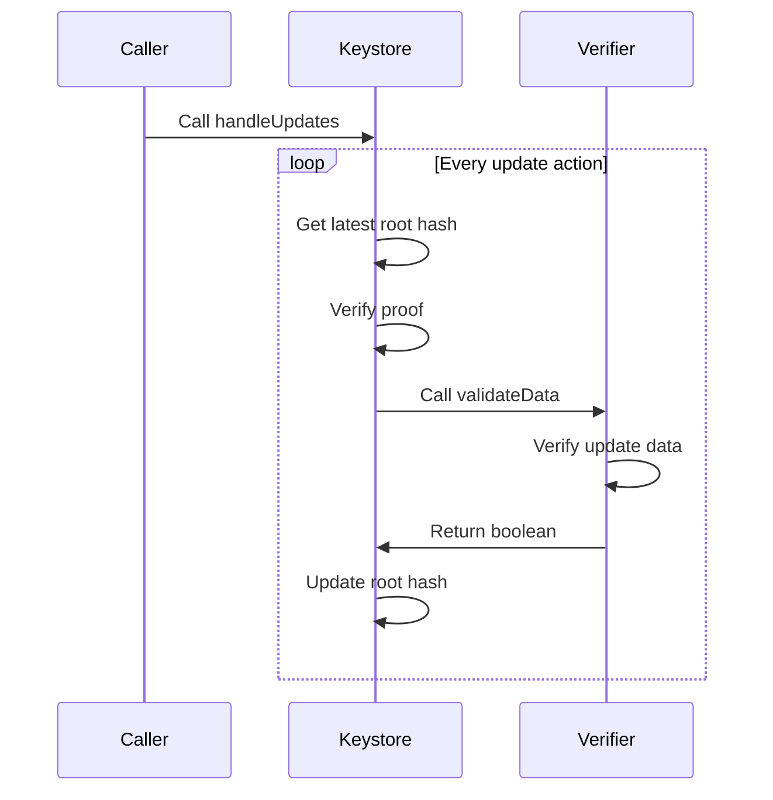
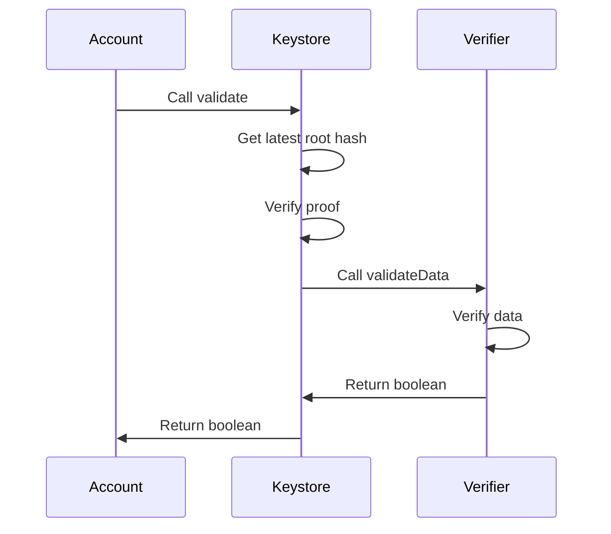

# Merkle Tree Keystore for Account Abstraction

A permissionless mechanism to decouple configuration from code to scale smart account validation with gas efficiency and privacy preserving properties.

## Abstract

The spec establishes a permissionless mechanism for decoupling a smart account's configuration from its code implementation. The solution centers around gas efficient Merkle tree proofs in order to validate account configuration at transaction time.

## Motivation

Smart accounts currently face UX challenges in scaling configuration. We define configuration here as any state that the account requires in order to validate transactions. Today, many smart accounts use simple schemes such as a single owner key or an N/M multisig setup. As smart account validation evolves (e.g. with permissions, multi-user sessions, and role-based access controls), configuration size also increases substantially. In this world, we quickly run into three primary issues.

1. **Gas cost**: The onchain storage cost of configuration makes support for modern verification use cases unfeasible.
2. **Lack of privacy**: Public exposure to an account's full configuration (e.g. a guardian set used for recovery) can introduce op-sec risk.
3. **Chain fragmentation**: If an account exists on `N` chains, a lot of friction is required to ensure cross-chain sync.

On point 3, there are also significant UX challenges in a scenario where an account hasn't yet been deployed to a new chain. For example, in any setup that is initialized with an admin key, the user must retain secure access to the original admin key to deploy the account followed by an immediate rotation to the current key. This not only creates friction but also contradicts best practices of frequent and secure key rotations.

This proposal primarily focuses on solving the gas and privacy issues. It does not solve chain fragmentation but opens a path to future viable solutions with the use of external cross-chain infrastructure.

## Specification

This proposal covers the specification of several key components:

1. `UserConfiguration` Merkle tree
2. Singleton `Keystore` contract
3. Stateless `Verifier` contract

### `UserConfiguration` Merkle tree (UCMT)

The `UserConfiguration` is a Merkle tree data structure designed to accommodate any arbitrary verification scheme. Each `node` is packed with 20 bytes (starting at the most significant bit) allocated to the `Verifier` address and the remaining dynamic size bytes for the config.

| Field    | Type      | Description                                                     |
| -------- | --------- | --------------------------------------------------------------- |
| verifier | `address` | Address pointing to the stateless `Verifier` contract           |
| config   | `bytes`   | Arbitrary calldata provided to the `Verifier` during validation |

```solidity
bytes node = abi.encodePacked(verifier, config)
```

The practical usage of this structure is detailed in subsequent sections. An essential point is that the entire Merkle tree itself is not stored onchain. Instead, only the resulting root hash is stored in the `Keystore` singleton. During a transaction, only a proof is used to validate that the UCMT has a specific node.

#### Abstract example

Consider an account with the following configuration. Suppose a transaction requires validation using `Node #3`. To validate this, a Merkle proof is generated using only the highlighted hashes below. These hashes enable the reconstruction of the root hash which can then be compared against the saved `Keystore` value.


### `Keystore` singleton

The `Keystore` is a permissionless singleton contract that can be deployed on any chain. It is responsible for:

1. Storing a reference to the latest UCMT root hash.
2. Coordinating a UCMT root hash update.
3. Coordinating the verification of a UCMT proof.

#### `Keystore` interface

This singleton MUST have the following interface.

```solidity
struct UpdateAction {
    bytes32 refHash;
    bytes32 nextHash;
    bytes32[] proof;
    bytes node;
    bytes data;
}

struct ValidationAction {
    bytes32 refHash;
    bytes32 message;
    bytes32[] proof;
    bytes node;
    bytes data;
}

interface Keystore {
    error InvalidNextHash();
    error InvalidProof();
    error InvalidNode();
    error InvalidVerifier();

    event RootHashUpdated(bytes32 indexed refHash, bytes32 oldRoot, bytes32 newRoot, bool success);

    function handleUpdates(UpdateAction[] calldata actions) external;
    function validate(ValidationAction calldata action) external view returns (bool);
}
```

#### Storage of root hashes

All root hashes in the `Keystore` contract MUST be stored in a mapping of the initial root hash to the current root hash.

```solidity
mapping(bytes32 refHash => bytes32 currentHash)
```

This is essential in order to provide an account with a permanent reference to the latest configuration. Without a permanent reference, it would be impossible for a dependent account to generate counterfactual addresses that are decoupled from configuration updates.

In the initial edge case where `currentHash` is equal to zero, then the `Keystore` MUST assume the `refHash` as the value.

#### Handling root hash updates

Updating a configuration set is equivalent to updating the current root hash in the `Keystore`. The essential data structure in this flow is the `UpdateAction` intent.

| Field      | Type        | Description                                   |
| ---------- | ----------- | --------------------------------------------- |
| `refHash`  | `bytes32`   | Permanent reference hash for the UCMT.        |
| `nextHash` | `bytes32`   | Next root hash after the update.              |
| `proof`    | `bytes32[]` | Merkle proof for the node.                    |
| `node`     | `bytes`     | Node data containing `verifier` and `config`. |
| `data`     | `bytes`     | Arbitrary data for the verifier.              |

On a systems level, the root hash update has the following lifecycle.



This process begins with the `Caller` initiating the `handleUpdates` function on the `Keystore` contract. For every `UpdateAction` in the batch, the `Keystore` MUST verify the UCMT proof. If ok, then the `Keystore` calls `validateData` on the `Verifier` encoded in the `node`. This will check if the update to the next root hash is valid and returns a corresponding boolean value.

Note that `handleUpdates` accepts a batch of `updateAction` objects by design in order to support use cases where other entities, such as solvers, are relaying updates on behalf of many accounts.

#### Using the `Keystore` for validation

The validation flow for an account that uses the `Keystore` singleton will have the following sequence.



During the account's validation phase, it makes a call to the `validate` function on the `Keystore`. The `Keystore` MUST verify the UCMT proof. If ok, then the `Keystore` calls `validateData` on the `Verifier` encoded in the `node`. This will check if the given signature for the message is valid and returns the corresponding boolean value.

### Stateless `Verifier`

The `Verifier` is a contract that enables any arbitrary signature scheme with no requirement for persistent onchain storage. Instead the `Verifier` can trust that the config passed by the `Keystore` has been cryptographically verified by the UCMT proof.

#### `Verifier` interface

```solidity
interface Verifier {
    function validateData(bytes32 message, bytes calldata data, bytes calldata config) external view returns (bool);
}
```

The `data` input is passed in by the user during a transaction and the `config` input is always equal to the `config` portion of the UCMT `node`.

In the example of a `SimpleECDSAVerifier`, the `data` is the 64 byte ECDSA signature while the `config` is the 20 byte signer address. The function `validateData` would then return an equality check on `config == ecrecover(message, data)`.

It is worth noting that there is no enforced data structure on the `data` and `config` input. This is entirely up to the `Verifier` to determine based on the intended validation scheme.

#### `Verifier` message format for a root hash update

When updating the root hash, the `Keystore` MUST call the `validateData` function with the following `message` format.

```solidity
bytes32 message = keccak256(abi.encode(refHash, nextRootHash, keccak256(node), keccak256(data)))
```

Note that `chainId` is not part of this message hash since it is expected that an `UpdateAction` can be replayed across all chains. It is the responsibility of the `Keystore` to prevent old `updateAction` objects to be replayed by only allowing an update to a new root hash once (i.e. using the `nextRootHash` as a nonce value).

## Rationale

Scaling smart account configuration involves many trade-offs. This section outlines why several key decisions were made for this spec.

### Using a Merkle tree

When approaching the problem space, two primary requirements must be satisfied:

1. A `Keystore` singleton must support arbitrary validation logic.
2. The solution must be gas-efficient regardless of the validation scheme.

As account validation evolves to accommodate increasingly complex scenarios, it is expected that the configuration size expands with it. A naive solution which directly stores configuration onchain may suffice for single validation methods like ECDSA or WebAuthn. However, this approach quickly becomes restrictive in terms of gas costs when implementing advanced use cases that cover the full spectrum of authentication and authorization.

Implementing a Merkle tree effectively addresses these concerns:

- A `Verifier` adhering to the proposed interface can implement any arbitrary validation logic.
- Gas efficiency is maximized by storing only the root hash in a single storage slot and handles verification in `O(log n)` space and time complexity (`n` equal to the total number of nodes).

This design decision also introduces important implications regarding privacy and data availability. By keeping the full configuration set offchain, accounts consequently benefit from enhanced privacy and allows them to selectively disclose validation details only when necessary. For instance, an account configured with an N/M guardian scheme can keep each guardian private until social recovery flows are explicitly triggered.

Because configuration is stored offchain, accounts MUST have reliable access to the Merkle tree to generate the necessary proofs. To preserve the outlined privacy benefits, this proposal deliberately avoids prescribing specific storage mechanisms.

### Cross-chain fragmentation

We've mentioned earlier that one significant challenge in scaling account state is ensuring it remains in sync across many chains and access can always be granted on new chains using the latest config. Although this standard does not propose a direct solution it does open a pathway for composability with external relayer and solver infrastructure depending on the wallet's preference.

Since `Keystore` supports batch updating via `handleUpdates`, this enables any independent entity to update config on behalf of many accounts based on their own agreed upon trust assumptions or incentive models.

#### Simple example with delegated relayers

A very simple approach for achieving cross chain sync is if a wallet delegates a relaying service to broadcast updates to all chains. In this approach there are two main concerns which are the security and incentives for relayers.

On security, it is not possible for a relayer to tamper with the `updateAction` object. Doing so will cause the `Keystore` to reject the update due to an invalid Merkle tree proof. It is also technically possible for any entity to watch for updates on one chain and copy them onto another chain if they are willing to pay the gas fee. Therefore the only reason a relayer would broadcast updates is if they are sufficiently compensated to do so.

In order to not blow up the complexity of this spec, a built in method for gas compensation was not added by design. Compensation for relayers could either be handled offchain (e.g. wallet pays for a relaying service) or onchain (e.g. wallet delegates a subscription like permission to the relaying service).

### Decoupling `Keystore` from the account to a singleton

The Keystore is required to be a decoupled from the account in order to ensure configuration can always be updated regardless of whether or not the account is deployed. If this same approach was built into the smart account code, then syncing config across new chains must always be preceded by an account deployment. This is problematic given that the account deployment will then have to be validated with potentially outdated config.

The singleton property is also required in order to preserve the deterministic deployment properties of a smart account. The smart account should always be initialized with the singleton address and `refHash`. What the `refHash` points to is then free to change and won't impact the account's deterministic address.

## Security Considerations

Assuming the `Keystore` contract is audited and verified to be safe, there are some downstream security considerations worth noting.

### `Verifier` should only trust the `Keystore`

Because the `Verifier` is not required to store configuration, it must trust the given config from a `validateData` call. If this config comes from the `Keystore` then it can be trusted given its validity has been cryptographically guaranteed by the Merkle tree proof. Therefore, a `Verifier` should only be called by the `Keystore` and calling the `Verifier` directly (e.g. via the account) should be avoided.

### Handling the Merkle tree data structure

The Merkle tree itself is not considered a secret value. If it was publicly exposed, then the privacy properties would become nullified since it would be possible to track associated recovery signers and verification schemes of the account. For operational security, it would be best practice to consider the account's Merkle tree as sensitive.

### Merkle tree data availability

A trade off with gaining the privacy properties of using a Merkle tree is that the onus is now on the wallet to ensure reliable access for proof generation. However, in the worse case, if the Merkle tree was lost then there could still be a route to recovering the account using onchain data from past transactions. For example, the wallet could scan for a past admin transaction and reuse the proof in order to update to a new Merkle tree configuration. But if no transactions were available then the account could become inaccessible.

Alternatively, if each individual node was known the wallet could also attempt to rebuild the Merkle tree by finding a permutation that matched the stored `rootHash`. This of course becomes more difficult at scale with many nodes.

It is therefore recommended that wallets provide robust backup options for the Merkle tree data. This ensures reliable access can always be restored in a failure mode event.

### Delegating relayers for cross-chain sync

The simple approach outlined in the rationale would be considered safe because there are no avenues for a compromised relayer to escalate privileges and gain full access to account funds. In the worst case, an account holder could pay the service fee and the relayer would not execute on the sync. In such a case the account is free to exit out of the relaying service with no lock-ins.

That said, there a legitimate security concerns if a relaying service is given the ability to update the `rootHash` on its own rather then only broadcasting updates that have been signed by the account holder. In the former case, there will be a clear route for privilege escalation where a relayer could update the `rootHash` to a config where it has the ability to access account funds.
